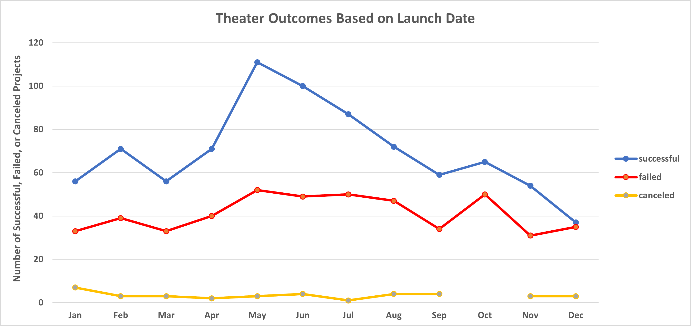

# Kickstarter Challenge - Module 1

## Overview of the Project 

The Kickstarter Dataset tabulates fundraising information for over four thousand crowdfunded projects. This project aims to uncover and analyze trends within this dataset to inform a Playwright’s decision to enroll in a crowdfunding campaign for her upcoming play, Fever. Using Microsoft Excel 365, this analysis intends to answer two main questions: 

    1.	When is the best time of year to begin a crowdfunding campaign for theater projects? 
    2.	How does the monetary amount of a theater campaign’s fundraising goal affect its success? 


## Analysis and Challenges

To better understand the effect of a theater campaign's start date on its outcome, I first needed to ensure I could filter the **Kickstarter** data to only include theater projects. Column N, * *Category and Subcategory* * originally contained two levels of categorization for each project, separated by a forward slash. See ] 

### You're a Text-To-Column Wizard Harry! 

Since the dataset contained multiple subcategories for every parent, I needed to separate the two using Excel's * *text to column wizard.* * By designating the forward slash as the delimiter, I was able to separate the * *Parent Category* * from the * *Subcategory,* * found in Columns Q and R, respectively. See  


The * *Kickstarter* * dataset contained Unix Time-stamps to represent the date and time in which the fundraising campaign was intiated. Thus, I needed to convert the Unix timestamp for each campaign, which can be found in Column J * *launched_at* * of the * *Kickstarter* * worksheet. While not particularly challenging, some background information is required to appreciate why this conversion is necessary and how it is performed:

### Epic Epochs

In the context of computer engineering, * *Epoch* * often refers to the standardized date/time that software refers to when determining the timestamp at a given moment. Unix operating systems determine * *Unix Time* * by counting the number of seconds that have elapsed since the * *Unix Epoch* * on 12:00:00 AM on January 1st, 1970. With the zero point set at midnight, Unix time automatically adds 86,400 ticks for every passing day. Although the Unix Epoch is timezone-dependent, which has the potential to complicate conversions in local timezones, Unix systems do not account for leap seconds, thus streamlining computational conversions between different epochs.  

In contrast to many other timestamping systems, MS Excel sets January 1st, 1900, as day 1 of the * *Excel Epoch.* * (The value 0 represents January 0, 1900, and must be taken into account in any Date/Time conversions between Excel and base-zero Epochs. Excel's numerical date-stamps usually take the form date.time, with whole number values representing the calendar date and decimal values representing the wall-clock time, proportionate to a 24-hour day. Additionally, earlier dates are not supported by Excel and will be stored as short text. 

For example, a timestamp equivalent to 12:35:14 PM (UTC) on April 11th, 2022, would register as 1649702114 in Unix Time and 44662.2744675925 when using Excel [Epoch Converter](https://www.epochconverter.com/)

### Converting Unix Time to Excel Date

Consequently, I added a new column, * *Date Created Conversion* * in column S of the Kickstarter worksheet, entered the formula from Figure 1 into Cell S2, and applied it to the rest of the cells in the column. This formula was determined by first converting the Unix timestamp in Column J from seconds-elapsed to days-elapsed by dividing the value in each cell by 86,400 to give the number of days elapsed since January 1st, 1970, the Unix Epoch. This Unix-inspired day-count was then added to the "+DATE(1970,1,1)" to account for the number of days between the Unix's and Excel's epochs. 
```
Unix Time to Excel Date Conversion:

=j2/60/60/24 + DATE(1970, 1, 1)
```

After applying this formula to all cells in the column, I was able to visualize the start date by highlighting the cells in the column and converting the format from * *General* * to * *Short Date.* * See . To allow for filtering by year, I entered the following formula in Cell * *U2* * and applied it to all cells in Column U, * *Years.* *

```
=YEAR(S2)
```

### PivotTable 
At this point, I was ready to create a PivotTable to analyze the relationship(s) between the projects' start date and their outcome as Successful, Cancelled, or Failed. See the worksheet named * *1. TheaterOutcomesByLaunchDate.* * 

Since I separated the Parent/Subcategory and Years columns from their original values in the **Kickstarter** dataset, I was able to designate both columns as Filters in my PivotTable, allowing for more detailed analyses of crowdfunding trends in specific industries during a set time period. See 

For the PivotTable, I wanted to count how many Successful, Failed, or Canceled projects were started in each month. To achieve this, I first designated the dataset's * *Date Created Conversion* * column as the * *Rows* * of my PivotTable. After removing the years and quarters from the * *Rows* * Field, the PivotTable only contained the starting month in which crowdfunding projects were initiated. See  Next, by dragging * *Outcomes* * to the * *Columns* * and * *Values* * fields in the PivotTable, I was able to display each of the possible * *Outcome* * values as PivotTable Columns and count the number of * *Successful, Failed, or Canceled* * for each month. See 

Once I had ensured that the fields in my PivotTable were accurate, I filtered the * *Column Labels* * in descending order so that * *Successful* * projects would be represented before less optimal outcomes. I also removed the * *Live* * projects from the PivotTable, since their success was yet to be determined. See . For the purposes of this analysis, I also filtered for Theater projects, exclusively, across all years. See 

Once the data was filtered and visualized properly, I inserted a stacked line graph representing the number of * *successful, failed or canceled* * outcomes based on the starting month of the project. See  and . 

### Play Outcomes based on Goal Amount

For the second analysis, I also wanted to visualize any relationships that may exist between a play's goal amount and its outcome as successful, failed, or canceled. In the worksheet **2. Outcomes by Goals,** I created Bins to effectively convert a project's numerical Goal amount into categorical Goal-bins, to analyze the number of successful, failed and canceled outcomes, for each bin. The categories range from * *Less than $1,000* * to * *50,000 or more,* * with bins that increase by $4,999, in-between. See  

By using the count-if functions, below, I was then able to determine the number of Successful, Failed, or Canceled projects, based on the upper and lower bounds of each category. Each outcome was assigned a column, asNote each criteria must accurately represent the Subcategory, * *Plays* *, the Outcome, * *Successful, Failed, or Canceled), 

```
=COUNTIFS(Kickstarter!$R:$R,"plays",Kickstarter!$F:$F,"successful",Kickstarter!$D:$D,"<1000")

=COUNTIFS(Kickstarter!$R:$R,"plays",Kickstarter!$F:$F,"failed",Kickstarter!$D:$D,">=15000",Kickstarter!$D:$D,"<=19999")

=COUNTIFS(Kickstarter!$R:$R,"plays",Kickstarter!$F:$F,"canceled",Kickstarter!$D:$D,">=50000")

```


### Source(s) of Error
Unfortunately, the * *Unix Time to Excel Date Conversion* * introduces error into our analysis since it does not account for the difference in starting points between Excel and Unix, with the former's Epoch being set to 1 and the latter's set to 0. Thus, the start date for each project is technically one day earlier than that found in the ***Date Created Conversion*** column. This slight error can easily be accounted for by subtracting one from the above calculation; 
```
=j2/60/60/24 + DATE(1970, 1, 1) - 1
```
see Column V: ***Date Created Update*** of the ***Kickstarter*** Worksheet. 


For the first 


## Results 